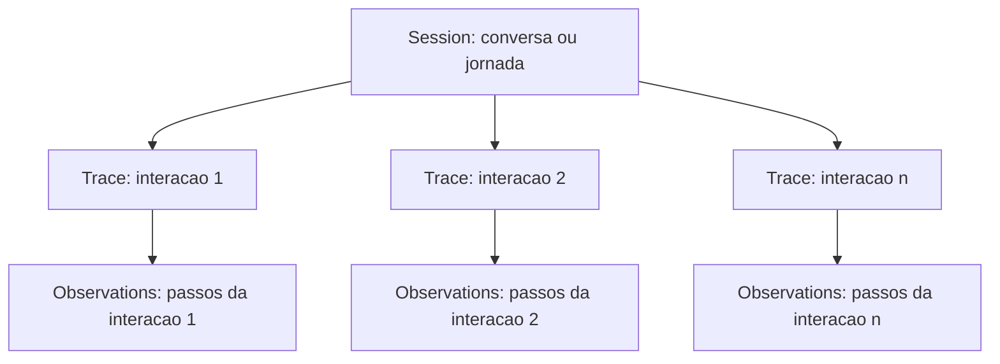
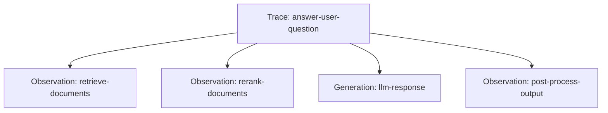
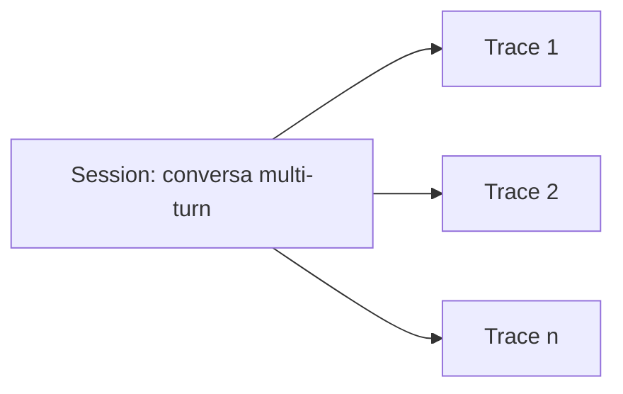
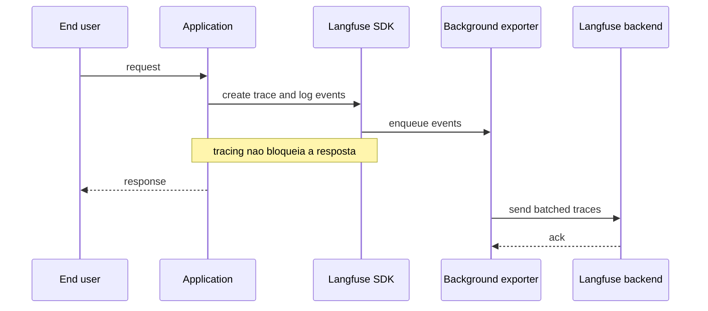

# 03 - Observabilidade

## Objetivo do modulo

Ensinar como Langfuse torna uma execucao LLM observavel.

O participante deve sair sabendo:

- O que e um trace.
- O que e uma observation.
- O que e uma generation.
- Como associar execucoes a usuario, sessao, ambiente e fluxo.
- Como usar traces para debugging.
- Como usar timeline, sessions, users, agent graphs e dashboards para investigar comportamento.

## Conceitos principais

Langfuse organiza os dados de uma aplicacao em tres conceitos principais:

- **Session:** agrupa traces que pertencem a uma mesma interacao maior, como uma conversa multi-turn.
- **Trace:** representa uma unica requisicao, operacao ou interacao.
- **Observation:** representa cada etapa individual dentro de um trace.

Visualmente:



Resumo visual:

> Session e a conversa ou jornada. Trace e uma interacao dentro dessa jornada. Observation e cada passo executado dentro da interacao.

### Trace

Representa uma execucao, requisicao ou operacao.

Exemplos:

- Uma pergunta respondida por um chatbot.
- Uma execucao de agente.
- Um pipeline de RAG.
- Uma chamada de classificacao.

Um trace deve incluir tanto chamadas LLM quanto etapas nao-LLM relevantes. Em um sistema real, isso pode envolver retrieval, embeddings, chamadas a APIs externas, tool calls, validacoes, decisoes de roteamento e etapas de pos-processamento.

O trace funciona como container de observations. Atributos do trace, como `user_id`, `session_id`, `tags` e `metadata`, devem ser propagados para as observations para permitir filtro, segmentacao e analise.

### Observation

Representa uma unidade de trabalho dentro de uma execucao.

Exemplos:

- Um span de processamento.
- Uma chamada ao modelo.
- Uma chamada de ferramenta.
- Um passo de retrieval.
- Um evento relevante.

Observations podem ser aninhadas. Isso permite representar hierarquia:



Exemplo mental:

- Trace: `answer-user-question`.
- Observation filha: `retrieve-documents`.
- Observation filha: `rerank-documents`.
- Observation filha: `llm-response`.
- Observation filha: `post-process-output`.

### Generation

Tipo de observation voltado para chamadas LLM.

Normalmente inclui:

- Modelo.
- Input.
- Output.
- Tokens.
- Latencia.
- Custo.
- Parametros.

### Session

Agrupa traces relacionados a uma mesma interacao maior.

Exemplos:

- Uma thread de chat.
- Uma conversa de suporte.
- Um workflow agentico com varias interacoes.
- Uma jornada de usuario em varias chamadas.



Usar sessions e recomendado para aplicacoes multi-turn ou fluxos com memoria, porque a qualidade da experiencia muitas vezes depende do conjunto da conversa, nao apenas de uma chamada isolada.

## Capacidades de observabilidade

### Trace details

Permitem acompanhar cada chamada LLM e cada trecho relevante da logica da aplicacao.

No workshop, o participante deve aprender a abrir um trace e reconstruir a execucao:

- Entrada recebida.
- Prompt montado.
- Modelo chamado.
- Resposta gerada.
- Passos intermediarios.
- Erros e excecoes.
- Tokens, custo e latencia.

### Sessions

Sessions agrupam conversas multi-turn ou workflows agenticos com multiplas etapas.

Isso e essencial para investigar comportamento que nao aparece em uma chamada isolada, como:

- Conversas longas.
- Agentes que tomam varias decisoes.
- Fluxos com memoria.
- Jornadas de usuario com varias interacoes.

### Timeline

A timeline ajuda a depurar latencia.

Em vez de olhar apenas o tempo total, o participante deve identificar onde o tempo foi gasto:

- Chamada ao modelo.
- Retrieval.
- API externa.
- Tool execution.
- Validacao ou pos-processamento.

### Users

Adicionar `user_id` permite acompanhar custo, uso e qualidade por usuario.

Isso habilita perguntas como:

- Quais usuarios geram maior custo?
- Quais usuarios estao tendo mais erros?
- Um problema afeta todos ou apenas um segmento?
- Como criar deep links entre sistemas internos e a visao de usuario no Langfuse?

### Agent graphs

Em aplicacoes agenticas, Langfuse pode representar o fluxo como grafo.

Essa visualizacao ajuda a explicar:

- Que caminho o agente tomou.
- Quais ferramentas foram chamadas.
- Onde houve loops ou decisoes inesperadas.
- Qual etapa gerou uma resposta ruim.

### Dashboards

Dashboards consolidam metricas de qualidade, custo e latencia.

O modulo dedicado esta em [08 - Monitoring, Métricas e Dashboards](08-metricas-dashboards.md). Aqui, o ponto mais importante e lembrar que dashboards dependem diretamente da instrumentacao: trace name, user, session, tags, environment, release, version, model e prompt version precisam ser enviados corretamente.

O ponto didatico e mostrar a diferenca entre investigar um trace individual e monitorar tendencia agregada.

## Formas de captura

Langfuse pode receber traces por diferentes caminhos:

- SDKs nativos de Python e JavaScript.
- Integracoes com bibliotecas e frameworks.
- OpenTelemetry.
- Gateway LLM, como LiteLLM.
- Instrumentacao customizada via API ou SDK.

Para o hands-on, o caminho principal deve ser o SDK. Depois, vale entender que a arquitetura nao depende exclusivamente dele, porque Langfuse usa OpenTelemetry como base de compatibilidade.

## Base OpenTelemetry

Langfuse e construido sobre OpenTelemetry.

Isso significa:

- O time nao fica preso apenas aos SDKs especificos do Langfuse.
- Aplicacoes que ja emitem spans OTEL podem enviar dados para Langfuse.
- O mesmo pipeline de telemetria pode enviar dados para mais de um destino, como Langfuse para observabilidade LLM e Datadog para infraestrutura.
- Instrumentacao existente pode ser reaproveitada quando fizer sentido.

Ponto central:

> OpenTelemetry reduz lock-in e aproxima observabilidade LLM da observabilidade de software que times de plataforma ja conhecem.

## Primeiro trace

O primeiro objetivo pratico e simples: fazer uma execucao aparecer na UI do Langfuse.

O participante deve entender que "ingerir o primeiro trace" significa:

1. Configurar credenciais do projeto.
2. Instrumentar a chamada LLM ou criar uma observation manual.
3. Rodar a aplicacao.
4. Abrir a interface do Langfuse.
5. Validar se input, output, modelo e metadados aparecem como esperado.

Esse primeiro trace e o ponto de partida para todos os recursos seguintes. Sem trace, nao ha base para analisar prompts, custo, latencia, usuarios, sessoes ou sinais de monitoring em contexto.

## Padroes de instrumentacao

### OpenAI Agents SDK

Usado quando a aplicação tem um agente com tools MCP, loop de execução e chamadas ao modelo.

Exemplo conceitual:

- A aplicação define um `Agent` com instruções e servidores MCP.
- O `Runner` executa o loop de tool calling.
- A instrumentação OpenInference captura spans do Agents SDK.
- O Langfuse recebe a execução via OpenTelemetry e preserva o trace do workshop.

Esse é o caminho principal do backend FastAPI deste workshop.

### Drop-in wrapper

Usado quando o framework ja tem uma integracao pronta.

Exemplo conceitual:

- A aplicacao ja usa um SDK de modelo com wrapper suportado pelo Langfuse.
- O import e trocado para o wrapper observável.
- A chamada ao modelo continua praticamente igual.
- O trace passa a ser enviado em background.

Esse caminho e bom para comecar rapido em outros projetos. Neste repositório, o caminho real é OpenAI Agents SDK apontando para OCI.

### Callback handler

Usado em frameworks que emitem eventos internos, como LangChain.

O callback escuta eventos da chain ou do agente e transforma essas execucoes em traces e observations.

Esse caminho e bom quando a aplicacao ja esta estruturada em chains, tools MCP ou agentes.

### Instrumentacao manual

Usada quando o time quer controle fino.

O desenvolvedor cria spans, generations e updates explicitamente.

Esse caminho e melhor para ensinar os conceitos, porque deixa claro:

- Onde a execucao comeca.
- Quais etapas sao filhas.
- Onde a chamada LLM acontece.
- Quando atualizar output.
- Quando chamar `flush` em scripts curtos.

### OpenTelemetry

Usado quando a aplicacao ja emite spans OTEL ou quando a linguagem/framework nao tem SDK especifico.

Esse caminho reforca a ideia de compatibilidade e menor lock-in.

## `flush` em aplicacoes curtas

Como os SDKs enviam dados em background, scripts curtos podem terminar antes do envio completo.

Em exemplos de workshop, CLIs, notebooks e scripts one-shot, incluir uma chamada de flush ao final evita confusao:

```python
langfuse.flush()
```

Mensagem didatica:

> Em servicos long-running, o envio em background acontece durante o ciclo normal da aplicacao. Em scripts curtos, chame `flush` para garantir que o trace chegou antes do processo encerrar.

## Processamento assíncrono

Langfuse nao envia cada trace de forma sincrona no momento em que ele e criado. Para evitar impacto desnecessario na aplicacao, o SDK normalmente coloca eventos em uma fila local, agrupa em batches e envia em background.



### Aplicacoes long-running

Em servidores web, APIs e workers permanentes, o exporter tem tempo para enviar batches naturalmente durante o ciclo de vida da aplicacao.

### Aplicacoes curtas

Em scripts, notebooks, CLIs e jobs curtos, o processo pode encerrar antes do envio em background.

Nesses casos, chamar `flush()` antes de sair e obrigatorio para evitar perda de traces.

## Metadados importantes

Em producao, traces sem contexto perdem valor. O hands-on deve reforcar o uso de:

- `user_id`.
- `session_id`.
- `metadata`.
- `tags`.
- `environment`.
- `release`.
- `version`.

## Atributos para filtro e analise

Depois que a aplicacao esta estruturada em sessions, traces e observations, atributos enriquecem os dados para analise.

| Atributo | Para que serve |
| --- | --- |
| `environment` | Separar dados de `production`, `staging` e `development`. |
| `tags` | Categorizar traces por feature, endpoint, fluxo, ambiente ou tipo de monitoramento. |
| `user_id` | Entender qual usuario gerou a execucao e agregar custo/uso por usuario. |
| `metadata` | Guardar informacoes customizadas em chave-valor. |
| `release` / `version` | Rastrear versoes da aplicacao, modelo, prompt ou componente. |

Sem esses atributos, Langfuse ainda mostra traces individuais. Com eles, o time consegue filtrar, segmentar, montar dashboards e investigar regressao por ambiente, release ou grupo de usuarios.

## Perguntas que a observabilidade deve responder

- Qual usuario foi impactado?
- Em qual sessao ocorreu?
- Qual fluxo executou?
- Qual modelo foi usado?
- Qual prompt foi usado?
- Qual foi o custo?
- Onde a latencia aumentou?
- Qual etapa falhou?
- O problema foi do modelo, do prompt, do retrieval ou da ferramenta?
- O fluxo agentico tomou o caminho esperado?
- O problema aparece em uma chamada isolada ou na sessao inteira?

## Exercicio central

Instrumentar uma aplicacao LLM simples e comparar:

1. Execucao sem Langfuse.
2. Execucao com trace minimo.
3. Execucao com usuario, sessao e metadados.
4. Execucao com passo intermediario nao-LLM.
5. Execucao com erro proposital.

## Resumo do capítulo

O objetivo nao e apenas "ver logs bonitos".

O objetivo e reconstruir uma execucao LLM de ponta a ponta e conseguir explicar o comportamento da aplicacao com evidencias.

Em software tradicional, muitas investigacoes param em logs, status code e stack trace. Em aplicacoes LLM, isso nao basta: a resposta pode estar formalmente correta do ponto de vista tecnico e ainda assim ser ruim. Observabilidade precisa mostrar o caminho completo ate a resposta.

## Próximo passo

Com o primeiro trace funcionando, o próximo avanço é controlar o prompt que gerou a resposta. Siga para [04 - Prompt Management](04-prompt-management.md) e, no workshop, execute [Tracing e observabilidade](workshop/02-tracing.md).
