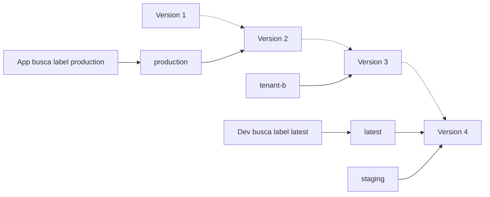

# 04 - Prompt Management

## Objetivo do modulo

Mostrar como Langfuse ajuda a tirar prompts hardcoded do codigo e transforma-los em artefatos versionados, colaborativos e rastreaveis.

## Problema

Prompts mudam com frequencia.

Quando prompts ficam apenas no codigo:

- Toda alteracao exige PR e deploy.
- Produto e especialistas de dominio dependem de engenharia para testar mudancas simples.
- Fica dificil saber qual versao gerou determinada resposta.
- Rollback de prompt fica acoplado a rollback de aplicacao.

## Proposta do Langfuse

Gerenciar prompts como artefatos versionados.

O time pode:

- Criar prompts no Langfuse.
- Versionar alteracoes.
- Usar labels como `staging` e `production`.
- Buscar prompts em runtime.
- Linkar prompts a traces.
- Comparar impacto de versoes.
- Testar prompts no playground antes de promover.
- Acompanhar custo, latencia e sinais monitorados por versao.

## Conceitos

### Prompt

Template usado pela aplicacao.

Pode ser:

- Texto.
- Chat prompt.
- Prompt com variaveis.

Em Langfuse, um prompt deve ser entendido como um objeto, nao apenas como uma string. Ele combina:

- Instrucoes para o LLM.
- Tipo do prompt: text ou chat.
- Variaveis e conteudo dinamico.
- Configuracoes opcionais que influenciam comportamento.
- Historico de versoes.
- Labels usados para deploy.

O tipo do prompt precisa ser escolhido na criacao. Depois de criado, o tipo nao deve ser tratado como algo mutavel, porque a aplicacao consome text prompts e chat prompts de formas diferentes.

### Text prompt

Representa um template que compila para uma string.

E ideal para casos simples, quando a aplicacao so precisa de uma instrucao unica ou de um system message simples.

Exemplo conceitual:

```txt
Como um critico {{criticlevel}}, avalie o filme {{movie}}.
```

Depois de compilado:

```txt
Como um critico experiente, avalie o filme Dune 2.
```

### Chat prompt

Representa uma lista de mensagens com roles.

E indicado quando o time quer gerenciar a estrutura completa de conversa:

- System message.
- User message.
- Assistant examples.
- Historico ou trechos de conversa.
- Few-shot examples com roles.

Exemplo conceitual:

```json
[
  {"role": "system", "content": "Voce e um critico {{criticlevel}}."},
  {"role": "user", "content": "Avalie o filme {{movie}}."}
]
```

Depois de compilado, o resultado continua sendo uma lista de mensagens pronta para enviar ao modelo.

Regra pratica:

- Comece com text prompt se o caso for simples.
- Use chat prompt quando precisar controlar mensagens com roles, exemplos ou estrutura de conversa.

### Variaveis

Langfuse usa variaveis no formato `{{nome_da_variavel}}`.

Isso permite separar o template do valor em runtime:

- O prompt define a estrutura.
- A aplicacao injeta valores como usuario, pergunta, produto, idioma, contexto ou nivel de detalhe.

Ponto de atencao: frameworks diferentes usam sintaxes diferentes. LangChain, por exemplo, costuma usar `{variavel}`. Ao integrar prompts Langfuse com LangChain, usar os helpers proprios do SDK para converter o formato quando necessario.

### Conteudo dinamico

Prompts podem receber conteudo dinamico de tres formas principais:

| Tipo | Uso |
| --- | --- |
| Variaveis | Inserir texto dinamico dentro de mensagens. |
| Prompt references | Reutilizar prompts dentro de outros prompts e evitar duplicacao de instrucoes comuns. |
| Message placeholders | Inserir arrays de mensagens, como historico de chat. |

Para a primeira etapa, vamos usar variaveis. Prompt references e message placeholders entram como recursos avancados para prompts maiores e sistemas conversacionais.

### Versao

Cada alteracao cria uma nova versao.

Isso permite auditar historico e comparar mudancas.

Se um prompt com o mesmo `name` ja existe, criar novamente com aquele nome adiciona uma nova versao em vez de substituir silenciosamente o historico.

Versoes devem ser tratadas como historico imutavel. O time nao deve pensar em "editar a versao em producao", mas sim em criar uma nova versao, validar e mover o label correto.

### Label

Labels apontam para versoes especificas.

Exemplos:

- `production`.
- `latest`.
- `staging`.
- `experiment-a`.
- `tenant-enterprise`.

Labels tambem funcionam como mecanismo de deploy. Ao mudar qual versao recebe o label `production`, a aplicacao passa a buscar a nova versao sem exigir alteracao de codigo.

Por padrao, quando a aplicacao busca um prompt sem especificar versao ou label, o comportamento recomendado no material e buscar a versao marcada como `production`. No workshop, producao deve ser intencional, nao "a ultima versao que alguem criou".

`latest` aponta para a versao mais nova. Ele e util para desenvolvimento e inspecao, mas nao deve ser confundido com `production`. Codigo de producao deve apontar para labels intencionais, nao para "o ultimo prompt criado".

Visualmente:



### Playground

O playground permite testar prompts interativamente antes de usar em producao.

No deep dive, ele deve ser usado para demonstrar iteracao rapida:

- Ajustar instrucao.
- Testar variaveis.
- Comparar saidas.
- Identificar problemas obvios antes de promover a nova versão.

### Link com traces

Quando prompts sao conectados aos traces, o time consegue responder:

- Qual versao de prompt gerou esta resposta?
- Essa versao tem maior custo?
- Essa versao piorou a latencia?
- Sinais monitorados mudaram depois da promocao?
- A regressao veio do prompt ou de outra parte da aplicacao?

### Metricas por versao

O valor do prompt management aumenta quando cada versao pode ser comparada por:

- Latencia.
- Custo.
- Feedback de usuario.
- Sinais de monitoring.
- Comportamento observado nos traces.

## Criando prompts

Langfuse permite criar ou atualizar prompts por varios caminhos.

### UI

Bom para demonstracao e colaboracao com pessoas nao tecnicas.

Fluxo:

1. Criar novo prompt.
2. Escolher tipo: text ou chat.
3. Inserir template e variaveis.
4. Adicionar label, como `production`.
5. Testar no playground.

### Python SDK

Bom para automacao, scripts internos ou migracao controlada.

Exemplo de text prompt:

```python
langfuse.create_prompt(
    name="movie-critic",
    type="text",
    prompt="Como um critico {{criticlevel}}, avalie o filme {{movie}}.",
    labels=["production"],
)
```

Exemplo de chat prompt:

```python
langfuse.create_prompt(
    name="movie-critic-chat",
    type="chat",
    prompt=[
        {"role": "system", "content": "Voce e um critico {{criticlevel}}."},
        {"role": "user", "content": "Avalie o filme {{movie}}."},
    ],
    labels=["production"],
)
```

### JS/TS SDK

Bom para aplicacoes e automacoes em Node.

```ts
await langfuse.prompt.create({
  name: "movie-critic",
  type: "text",
  prompt: "Como um critico {{criticlevel}}, avalie o filme {{movie}}.",
  labels: ["production"],
});
```

### API

Bom para integracoes, CI/CD ou migracoes em massa.

Exemplo conceitual:

```bash
curl -X POST "https://cloud.langfuse.com/api/public/v2/prompts" \
  -u "your-public-key:your-secret-key" \
  -H "Content-Type: application/json" \
  -d '{
    "type": "chat",
    "name": "movie-critic",
    "prompt": [
      {"role": "system", "content": "Voce e um critico {{criticlevel}}."},
      {"role": "user", "content": "Avalie o filme {{movie}}."}
    ]
  }'
```

### Migracao de prompts existentes

Quando prompts ja existem no codigo, o objetivo e migrar sem perder comportamento.

Checklist de migracao:

- Encontrar prompts hardcoded.
- Identificar variaveis embutidas no texto.
- Converter variaveis para o formato `{{variavel}}`.
- Escolher tipo correto: text ou chat.
- Criar prompt no Langfuse.
- Marcar a versao atual como `production`.
- Atualizar a aplicacao para buscar e compilar o prompt.
- Linkar o prompt ao trace para medir impacto.

Instalacao assistida por agente tambem pode ser usada nesse fluxo. O prompt conceitual para o agente e:

```txt
Migre os prompts hardcoded deste codebase para o Langfuse Prompt Management.
```

## Usando prompts em runtime

### Buscar a versao de producao

Em runtime, a aplicacao busca o prompt pelo nome. A versao de `production` deve ser a padrao.

Exemplo Python:

```python
from langfuse import get_client

langfuse = get_client()

prompt = langfuse.get_prompt("movie-critic")
compiled_prompt = prompt.compile(criticlevel="experiente", movie="Dune 2")
```

Exemplo JS/TS:

```ts
import { LangfuseClient } from "@langfuse/client";

const langfuse = new LangfuseClient();

const prompt = await langfuse.prompt.get("movie-critic");
const compiledPrompt = prompt.compile({
  criticlevel: "experiente",
  movie: "Dune 2",
});
```

### Chat prompt em runtime

Chat prompts compilam para uma lista de mensagens.

Exemplo Python:

```python
chat_prompt = langfuse.get_prompt("movie-critic-chat", type="chat")
messages = chat_prompt.compile(criticlevel="experiente", movie="Dune 2")
```

Esse resultado pode ser enviado diretamente para um modelo que espera `messages`.

### Buscar por label ou versao

Em producao, preferir label.

Exemplos conceituais:

- `production`: versao ativa para usuarios finais.
- `staging`: versao candidata.
- `latest`: versao mais recente, boa para inspecao, mas perigosa como default de producao.

Buscar por versao especifica e util para debugging, reproducao ou comparacao controlada.

### Integracao com OpenAI Agents SDK e OCI

Fluxo mental usado no backend do workshop:

1. Buscar o system prompt no Langfuse por label.
2. Usar o prompt como `instructions` do `Agent`.
3. Executar o agente com `Runner.run` usando provider apontado para OCI.
4. Enviar `trace_metadata` e attributes para ligar sessão, usuário, prompt e resultado.

### Integracao com LangChain

Ponto de atencao: Langfuse e LangChain usam sintaxes diferentes de variaveis.

Ao usar LangChain, preferir helpers como `get_langchain_prompt()` / `getLangchainPrompt()` para converter o prompt para o formato esperado pelo framework.

### Integracao com Vercel AI SDK

Fluxo mental:

1. Buscar prompt com `@langfuse/client`.
2. Compilar variaveis.
3. Enviar para `generateText`.
4. Ativar telemetry se o objetivo tambem for observar a chamada.

## Cache de prompts

Langfuse usa cache de prompts por dois motivos principais:

1. Reduzir latencia na aplicacao.
2. Reduzir risco de disponibilidade se Langfuse estiver indisponivel no momento do fetch.

Isso significa que os primeiros traces depois de atualizar um prompt podem ainda usar a versao anterior. Se a atualizacao imediata for critica, o time precisa configurar TTL menor ou desabilitar cache no caminho apropriado.

Ponto de atenção:

> Prompt management reduz latencia e risco operacional com cache, mas isso significa que testes de versao precisam considerar comportamento de cache. Para debug, sempre confirme qual label, versao e ambiente a aplicacao esta buscando.

Perguntas de troubleshooting:

- A aplicacao esta buscando `production`, `latest`, uma versao fixa ou um label customizado?
- O label aponta para a versao esperada?
- O cache ainda esta servindo a versao antiga?
- O ambiente testado e o mesmo ambiente onde o label foi alterado?

## Fluxo recomendado

1. Criar prompt no Langfuse.
2. Testar no playground.
3. Marcar versao inicial como `production`.
4. Buscar prompt pela aplicacao.
5. Linkar prompt aos traces.
6. Criar nova versao.
7. Testar com label `staging`.
8. Validar em traces de desenvolvimento.
9. Comparar custo, latencia e sinais de monitoring por versao.
10. Promover para `production`.
11. Observar traces, monitores e dashboards por versao.

## Workflow de deploy

Um fluxo tipico de deploy de prompt:

1. **Criar e testar:** criar nova versao. Ela recebe `latest`.
2. **Validar:** testar no ambiente de desenvolvimento, playground ou traces reais.
3. **Deploy:** mover o label `production` para a nova versao.
4. **Monitorar:** a aplicacao de producao busca o label e passa a usar a nova versao no proximo fetch valido.
5. **Rollback:** se necessario, mover `production` de volta para uma versao anterior.

Como o codigo referencia labels, esse fluxo acontece sem mudanca de codigo.

## Proximo passo apos o primeiro prompt

Depois que o primeiro prompt esta em uso, os proximos passos recomendados sao:

- Linkar prompts a traces para analisar performance por versao.
- Usar version control e labels para gerenciar deploy entre ambientes.
- Monitorar custo, latencia e qualidade por versao.

## Exercicio central

Transformar um prompt hardcoded em prompt gerenciado pelo Langfuse.

Passos:

1. Rodar aplicacao com prompt no codigo.
2. Criar prompt equivalente no Langfuse.
3. Testar o prompt no playground.
4. Atualizar app para buscar o prompt.
5. Linkar prompt ao trace.
6. Criar uma segunda versao.
7. Comparar comportamento.
8. Fazer rollback via label.

## Resumo do capítulo

Prompt management desacopla iteracao de prompt de deploy de codigo. Isso permite que times testem, promovam e revertam prompts com mais controle, mantendo rastreabilidade entre versao de prompt e comportamento observado em producao.

O ciclo completo é:

1. Criar via UI, SDK ou API.
2. Testar no playground.
3. Compilar variaveis em runtime.
4. Versionar mudancas.
5. Promover por label.
6. Linkar com traces.
7. Comparar custo, latencia e comportamento observado.
8. Fazer rollback se necessario.

Checklist para produção:

- Versoes sao historico imutavel.
- Labels apontam para versoes.
- `production` e o default seguro para apps.
- `latest` aponta para a versao mais nova.
- Deploy e mover `production`.
- Rollback e mover `production` de volta.
- Tudo isso acontece sem mudar codigo.

Escolha do tipo:

- Text prompt compila para string.
- Chat prompt compila para lista de mensagens.
- O tipo e escolhido na criacao.
- Variaveis usam `{{variavel}}`.
- Prompt references reutilizam instrucoes comuns.
- Message placeholders inserem arrays de mensagens.
- A aplicacao busca `production` por padrao.
- Versao especifica serve para debugging e reproducao.

## Próximo passo

Depois de versionar o prompt, configure monitoring para acompanhar como a nova versão se comporta em traces reais. Siga para [08 - Monitoring, Métricas e Dashboards](08-metricas-dashboards.md) e, no workshop, execute [Prompt Management](workshop/03-prompt-management.md).
