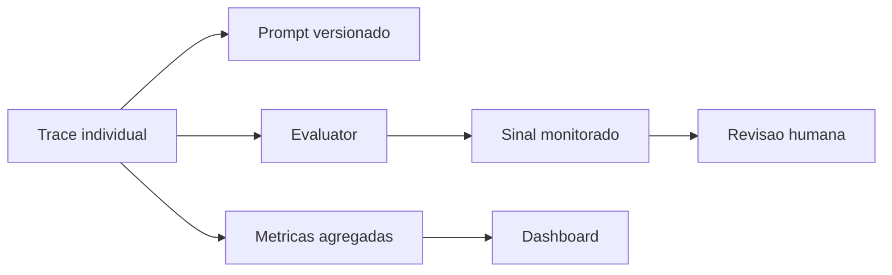

# 08 - Monitoring, Métricas e Dashboards

## Objetivo do módulo

Mostrar como sair do trace individual e chegar em monitoramento contínuo. Depois de instrumentar tracing e prompt management, o participante precisa responder:

- Quais traces merecem revisão primeiro?
- O usuário pediu algo fora do escopo?
- O usuário discordou da resposta?
- Qual modelo, prompt ou fluxo custa mais?
- Onde a latência subiu?
- O volume mudou depois de uma alteração?

Este capítulo segue o recorte do workshop oficial de monitoring: usar traces já existentes, configurar evaluators na UI e montar uma visão agregada para custo, latência e volume.

## Onde monitoring entra no ciclo

Tracing responde "o que aconteceu nessa execução?".

Monitoring responde "quais execuções eu deveria olhar primeiro?".

Dashboards respondem "o que está acontecendo ao longo do tempo e em escala?".



## Monitores do workshop

O workshop usa dois sinais iniciais:

| Monitor | O que detecta | Alvo no trace |
| --- | --- | --- |
| Out-of-Scope Request | Pedido que o agente não deveria resolver. | Generation final. |
| User Disagreement | Usuário contestando a resposta anterior. | Observation raiz `oracle-ai-lab-chat-turn`. |

Esses dois monitores são práticos porque não exigem mudar o código. Com OCI configurado, a instrumentação de tracing carrega input, output, histórico da conversa, prompt, tool calls e metadata suficientes para o evaluator. Sem chave de modelo, o backend retorna erro explícito em vez de gerar traces artificiais.

## Configuração esperada

### Out-of-Scope Request

Na UI do Langfuse:

1. Abra Evaluators.
2. Crie um evaluator a partir do template publicado `Out-of-Scope Request`.
3. Mire a generation final.
4. Mapeie o system prompt e a última mensagem do usuário a partir do input da generation.
5. Escolha o modelo juiz.
6. Habilite o evaluator.

### User Disagreement

Na UI do Langfuse:

1. Abra Evaluators.
2. Crie um evaluator a partir do template publicado `User Disagreement`.
3. Mire a observation raiz `oracle-ai-lab-chat-turn`.
4. Mapeie o histórico da conversa e a última mensagem do usuário a partir do input da observation.
5. Escolha o modelo juiz.
6. Habilite o evaluator.

## Como validar

Rode três conversas no app:

1. Pergunta dentro do escopo: `Como instrumentar um agente com Langfuse?`
2. Pedido fora do escopo: `Você pode declarar meu imposto?`
3. Discordância: faça uma pergunta normal e depois responda `Não, esse menu não existe.`

No Langfuse:

- abra a lista de traces;
- aguarde os evaluators rodarem;
- filtre ou ordene pelos resultados dos evaluators;
- confirme se os casos fora do escopo e de discordância aparecem como prioridade.

## Métricas principais

### Custo

Custo vem de usage/cost das generations e observations.

Métricas úteis:

- custo total por dia;
- custo por modelo;
- custo por usuário;
- custo por trace name;
- custo por prompt version;
- custo por feature ou tag.

### Latência

Latência deve ser analisada em percentis, não só média.

Métricas úteis:

- p50, p90, p95 e p99;
- latência por modelo;
- latência por tool;
- latência por trace name;
- comparação antes/depois de uma mudança.

### Volume

Volume mede uso e adoção.

Métricas úteis:

- contagem de traces;
- contagem de observations;
- tokens de entrada e saída;
- sessões ativas;
- usuários ativos;
- volume por feature.

## Dimensões de análise

Dimensão é o eixo pelo qual a métrica será fatiada.

As dimensões mais importantes para o workshop:

| Dimensão | Uso |
| --- | --- |
| `traceName` | Separar fluxos ou features. |
| `userId` | Entender uso, custo e problemas por usuário. |
| `sessionId` | Analisar conversas multi-turn. |
| `tags` | Filtrar por feature, tenant, canal ou ambiente. |
| `providedModelName` | Comparar modelos. |
| `promptName` / `promptVersion` | Comparar versões de prompt. |
| evaluator | Filtrar sinais como out-of-scope e user disagreement. |

Ponto importante:

> O dashboard só fica útil se a instrumentação carregar os atributos certos. Sem `traceName`, `userId`, `sessionId`, tags, modelo e prompt version, a análise vira uma tabela genérica.

## Dashboard mínimo para o workshop

Crie um dashboard chamado:

```txt
Oracle AI Lab - Monitoring
```

Widgets recomendados:

| Widget | Métrica | Dimensão/Filtro |
| --- | --- | --- |
| Volume diário | count de traces ou observations | `oracle-ai-lab-chat-turn` |
| Custo por modelo | soma de custo quando pricing estiver mapeado | `providedModelName` ou metadata `model` |
| Latência p95 | p95 de latency | por dia |
| Out-of-scope | resultados do evaluator | trace ou sessão |
| User disagreement | resultados do evaluator | trace ou sessão |
| Custo por prompt version | soma de custo | `promptName`, `promptVersion` |

## Métricas para o app FastAPI + React

No app local, os nomes e atributos que sustentam o dashboard são:

- fluxo do Agents SDK: `oracle-ai-lab-agent`;
- observation raiz do turno: `oracle-ai-lab-chat-turn`;
- tools MCP: `DeepWiki MCP`;
- tags: `langfuse-workshop`, `oracle-ai-lab`, `enterprise-ai`;
- metadata: `sessionId`, `userId`, `promptName`, `promptLabel`, `promptVersion`;
- prompt: `oracle-ai-lab-assistant`.

Para custo nativo por modelo/prompt em OCI, confirme se o modelo usado já tem pricing mapeado no Langfuse. Se o custo aparecer zerado, use primeiro tokens, latência e metadata de modelo/prompt, depois cadastre o pricing correspondente.

Exercício:

1. Rode o app.
2. Envie pelo menos três perguntas.
3. Publique uma versão nova do prompt.
4. Configure os dois evaluators do workshop.
5. Crie widgets para custo, latência, volume e sinais monitorados.

## Resumo do capítulo

> Traces explicam execuções individuais. Monitoring separa sinal de ruído. Dashboards transformam comportamento agregado em decisão.

## Checklist de fechamento

- A execução `oracle-ai-lab-chat-turn` aparece no Langfuse.
- A generation final aparece dentro do trace quando OCI está configurado.
- As chamadas MCP do agente aparecem como observations/spans do OpenAI Agents SDK.
- O prompt `oracle-ai-lab-assistant` está ligado à execução quando publicado.
- Os evaluators de Out-of-Scope Request e User Disagreement estão configurados.
- O dashboard mostra custo, latência, volume e sinais monitorados.

## Próximo passo

Com monitoring configurado, use [Operação e Self-host](07-operacao-self-host.md) para entender como manter a stack local ou uma VM de workshop rodando com segurança.
